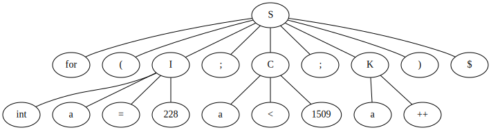
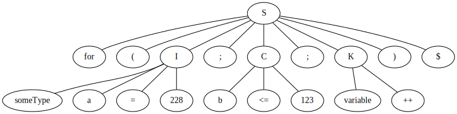
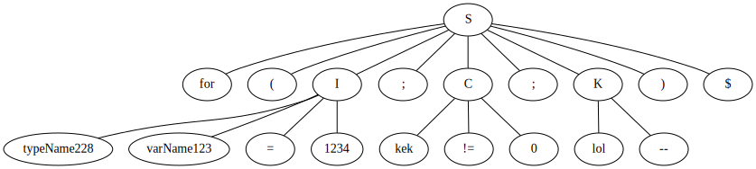

# Лабораторная работа №2.Ручное построение нисходящих синтаксических анализаторов.

Лабораторную работу выполнил студент группы M33341, Лиханов Максим

### Оператор for в Си
Примитивная версия оператора for в Си. Оператор начинается ключевым словом “for”, далее в скобках три параметра, разделенные точкой
с запятой. Первый параметр: имя типа, имя переменной, начальное значение. Второй параметр: имя переменной, знак сравнения, число. Третий
параметр: имя переменной, операция инкремента/декремента.

Используйте один терминал для всех имен переменных и имен типов.
Используйте один терминал для ключевого слова for (не несколько ‘f’,
‘o’, ‘r’). Используйте один терминал для оператора ++ (не два плюса).

<b> Пример: for (int x = 0; x < 10; x++) </b>

## Ход работы

### 1. Разработка грамматики 
Интуитивная грамматика для оператора for в Си выглядит следующим образом:

    S -> for ( I ; C ; K )
    I -> word word = number
    C -> word O number
    K -> number++
    K -> number--
    O -> ==
    O -> !=
    O -> <=
    O -> >=
    O -> <
    O -> >

В грамматике нет *левой рекурсии*, однако присутствует *правое ветвление*. Избавимся от него:

    S -> for ( I ; C ; K )
    I -> word word = number
    C -> word O number
    K -> number D
    D -> ++
    D -> --
    O -> ==
    O -> !=
    O -> <=
    O -> >=
    O -> <
    O -> >

Описание:

| Нетерминал |            Описание            |
|:----------:|:------------------------------:|
|     S      |       Стартовый терминал       |
|     I      |        Первый параметр         |
|     C      |        Второй параметр         |
|     K      |        Третий параметр         |
|     D      | Оператор инкремента/декремента |
|     O      |       Оператор сравнения       |

Отлично, эта грамматика потенциально соответствует LL(1) грамматике (убедимся в следующем пункте).

### 2. Построение лексического анализатора.

Лексический анализатор должен получать на вход строку и выдавать
последовательность терминалов (токенов). Пробелы и переводы строк
должны игнорироваться.

Лексический анализатор находится в пакете <code>[lexis](src/main/kotlin/lexis)</code>.

| Терминал |     Токен      |
|:--------:|:--------------:|
|   for    |      FOR       |
|  number  |     NUMBER     |
|   word   |      WORD      |
|    =     |     ASSIGN     |
|    (     |  OPEN_BRACKET  |
|    )     | CLOSE_BRACKET  |
|    ;     |   SEMICOLON    |
|    ++    |   INCREMENT    |
|    --    |   DECREMENT    |
|    ==    |     EQUALS     |
|    !=    |   NOT_EQUALS   |
|    <=    |  LESS_EQUALS   |
|    >=    | GREATER_EQUALS |
|    <     |      LESS      |
|    >     |    GREATER     |
|    $     |      END       |

### 3. Построение синтаксического анализатора. 

Лексический анализатор находится в пакете <code>[syntax](src/main/kotlin/syntax)</code>.

| Нетерминал |        FIRST         |  FOLLOW   |
|:----------:|:--------------------:|:---------:|
|     S      |         for          |     $     |
|     I      |         word         |     ;     |
|     C      |         word         | number, ; |
|     K      |         word         |     )     |
|     D      |        ++, --        |     )     |
|     O      | ==, !=, <=, >=, <, > |  number   |

### 4. Визуализация дерева разбора. 

Реализована при помощи GraphViz.

Код интерпретации в язык DOT находится в пакете <code>[graph](src/main/kotlin/graph)</code>.

### 5. Подготовка набора тестов.

Тесты можно найти <code>[здесь](src/test/kotlin)</code>.